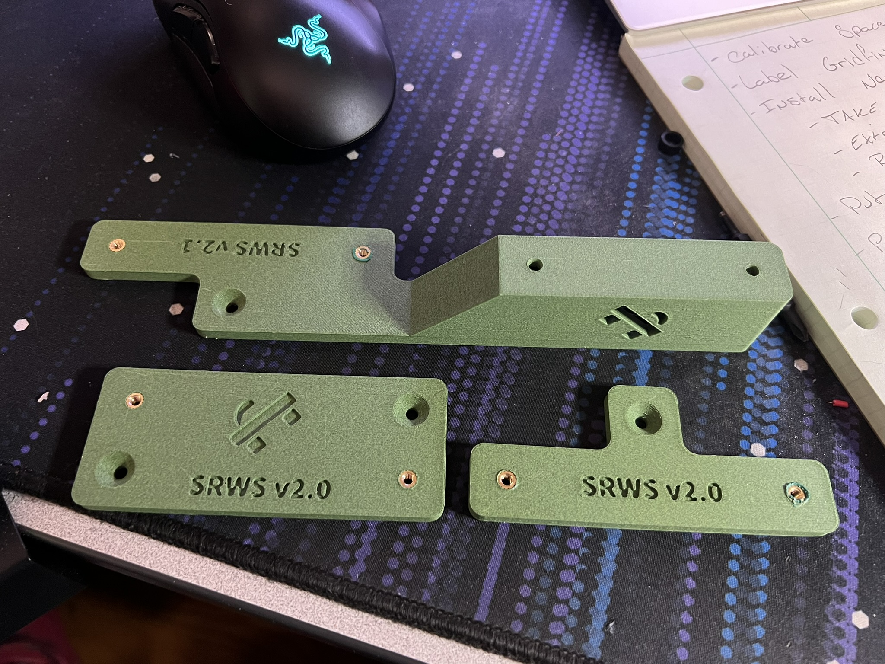

# Samurai Rabbit Wooden Sandal

The SRWS is a Mounting Adapter for ERCFv2 that allows for mounting the system to walls or desks using wood screws.

It has two versions, Katana and Tanto.  Katana has additional mounting the universal box if you don't use the ERCT, while Tanto is for mounting the full system with the ERCT. 

## BOM - Base
4x Heat Inserts M3x4x5
3x Wood Screws
2x M3x10 SHCS
2x M3x8 SHCS

## BOM - Katana
2x M3x8 SHCS

## Setup

1. Choose your configuration:  If you have ERCT or some other way of mounting the Universal box, choose the Tanto file.  If you don't, choose Katana
2. Install heat inserts in all of the small non-chamfered holes on the flat parts. 
3. Screw the ERCFv2 to the adapters using the 2x M3x10 SHCS on the Right side and the 2x M3x8 SHCS on the left side.  If you're using Katana, also screw the Universal Box into the the top of the Katana by inserting screws from the underside of the Katana through to the heat inserts on the bottom of the Universal Box. 
4. Mount to whatever you want.  Use the 3x Wood Screws to mount the system to whatever wood you want.  Go nuts! 
